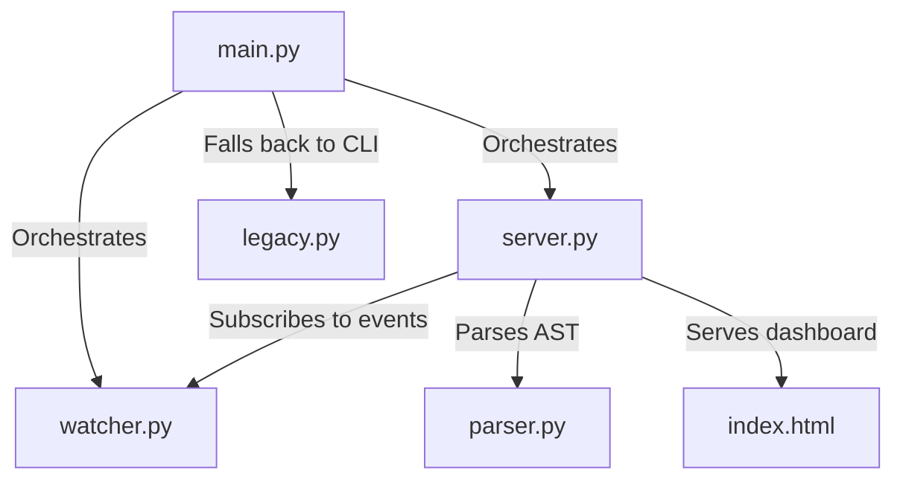

# Friday Call Graph Visualizer — Developer Documentation

The **Friday Call Graph Visualizer** is a real-time, interactive development tool that constructs, tracks, and renders structural code paths, call hierarchies, classes, and annotations in Python source files. It combines static AST analysis with a responsive split-pane web UI featuring **Monaco Editor** and **vis-network**.

---

## 1. Project Architecture

The application is structured into modular, single-responsibility components:

*   **`main.py`**: The application launcher. It resolves paths, starts the Flask web server, and triggers browser pages.
*   **`parser.py`**: The AST scope visitor. Extracts functions, classes, decorators, loops, conditionals, metrics (Complexity, LOC), and cross-file dependencies.
*   **`watcher.py`**: Recursive file watcher pushing Server-Sent Events to the client when files modify.
*   **`server.py`**: Flask server API handling overlays, graphs, configuration, and dynamically fetching contents.
*   **`legacy.py`**: Matplotlib fallback renderer.
*   **`index.html`**: Premium split-pane frontend editor & vis-network graph canvas.

---

## 2. Core Static Analysis Mechanics

The AST Visitor (`FunctionCallVisitor` in `parser.py`) applies several logic rules to analyze Python structures accurately:

### Scope Stack & Namespace Resolution
*   Definitions (classes and functions) are prefixed with their defining module name (e.g. `parser.FunctionCallVisitor.visit_Call`).
*   This module namespace isolates functions of the same name defined in different files.

### Static Import Mapping
The visitor inspects `Import` and `ImportFrom` nodes, generating an internal `import_map` dictionary:
*   `from watcher import add_client as add_cli` $\rightarrow$ `import_map['add_cli'] = 'watcher.add_client'`

### Cross-Module Call Post-Processing
After visitors parse all files in the workspace, the project parser post-processes the graph's edges:
1.  **Import expansion**: Resolves names according to `import_map`.
2.  **Local qualification**: Qualifies targets defined locally in the same file with the module prefix.
3.  **Module checks**: Maps direct calls between project files.
4.  **External falls**: Maps standard calls (e.g. `len`, `print`).

### Static Metrics (LOC & Complexity)
*   **Lines of Code (LOC)**: Measures line span using `node.end_lineno - node.lineno + 1`. If `LOC > 50`, the dashboard triggers a visual label `(Long function)` in tooltips.
*   **Cyclomatic Complexity**: Measures decision density. Calculates branching points recursively by scanning AST structures for conditionals (`If`, `IfExp`), loops (`For`, `While`), exceptions (`ExceptHandler`), switches (`Match`), and Boolean operands (`BoolOp` logic chains). If the complexity exceeds `7`, tooltips append `⚠️ High complexity`.

---

## 3. Advanced View & Styling Modes

The dashboard handles complex graph data structures dynamically to produce secondary architectural views:

### Module Dependency Graph View (Architecture map)
When `viewLevel` is set to `'module'`, the frontend transforms the function call graph:
1.  **Node Aggregation**: It groups functions and classes by their `module_prefix`. Each module becomes a single rectangular box node (e.g. `server.py`).
2.  **Metrics Accumulation**: Sums the LOC, complexity indexes, classes count, and functions count for all children inside that file.
3.  **Edge Rollup**: Joins function-to-function calls across files into single module-to-module arrows, summing up their call weights.
4.  **Monaco Linkage**: Double-clicking a module box automatically loads its corresponding `.py` file path into Monaco Editor.

### Complexity Heatmap View (Refactoring hotspots)
When `activeColorMode` is set to `'complexity'`, user defined function nodes are styled using a color threshold:
*   **Complexity $\le 3$ (Simple)**: Blue node color (`#3b82f6`).
*   **Complexity $4$ to $7$ (Moderate)**: Amber node color (`#f59e0b`).
*   **Complexity $> 7$ (Complex)**: Red node color (`#ef4444`).

---

## 4. Web API Endpoints

The Flask server (`server.py`) exposes the following endpoints:

*   **`GET /`**: Serves `index.html`.
*   **`GET /api/config`**: Returns target file path, basename, and workspace directories.
*   **`GET /api/file-content?file=relative_path`**: Reads dynamic file contents, preventing directory traversal.
*   **`GET /api/graph`**: Computes project-wide node and edge structures.
*   **`POST /api/parse`**: Compiles code string overlays dynamically as you type.
*   **`GET /api/events`**: Handles SSE event queues for hot-reloading.

---

## 5. Web Interface & Interactive Options

*   **Monaco Dynamic File Loading**: Double-clicking a node defined in a different file dynamically fetches its content and loads it into Monaco Editor.
*   **Focus Mode (Path Highlighting)**: Selecting any node isolates its upstream callers and downstream callees, keeping them fully opaque while fading out all other elements to 15% opacity.
*   **Search Box**: Floating input to search, zoom-in, select, and activate Focus Mode on any node.
*   **Libs Filter**: Hides external libraries and built-ins.
*   **Decay Slider**: Custom slider adjusting dynamic physics velocity damping (friction).
*   **Physics Switch**: Disables node floating/springs once nodes settle.
*   **Hierarchical Layout**: Switches the layout from dynamic forces to structured tree charts (Top-Down or Left-Right).
*   **Export PNG**: Captures the vis-network HTML canvas and downloads it.
